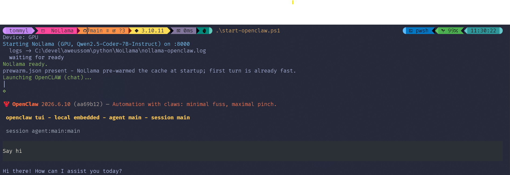
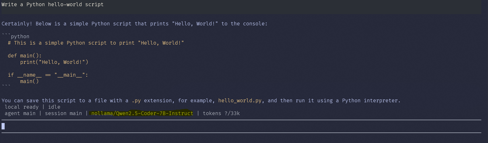

# Your Intel Laptop Can Run OpenClaw. No NVIDIA. No Cloud. No Problem.

A while back I wrote that [your Intel laptop can run LLMs right now](https://dev.to/tommy_leonhardsen_81d1f4e/your-intel-laptop-can-run-llms-right-now-no-nvidia-no-cloud-no-problem-3ejo) — on the NPU, the iGPU, whatever Intel quietly shipped you. About 1,500 of you read it, which for a Systems Specialist who is still unclear on how he became a person who writes software, is a startling number.

That article was about **chat** — type a question, get an answer. This one is about something with hands: **[OpenClaw](https://github.com/openclaw/openclaw)**, a full personal AI agent, running entirely on the Intel laptop. No cloud model behind the curtain.

It works now. Getting there involved one genuinely stupid mistake and one fix that changed everything. Let's go.

## So what is OpenClaw?

OpenClaw 🦞 is a self-hosted **personal AI assistant**. It plugs into the chat apps you already use (WhatsApp, Telegram, Slack, Discord, iMessage…), and it can browse the web, wrangle files, run commands, send you a morning briefing, and — yes — write and edit code. It's deliberately **model-agnostic**: Claude, GPT, Gemini, or *any local model behind an OpenAI/Ollama-style endpoint*.

That last bit is the crack in the door. OpenClaw normally points at a cloud model (or a chunky local one on a fat GPU). I wanted it pointed at **nothing but my Intel laptop**.

In this post I'll use it as a **coding** assistant, because that's the demo that screenshots well and you're on DEV. But the same setup drives all the automation-butler stuff too.

## The plan (and why it should "just work")

OpenClaw speaks the **OpenAI chat-completions API**. [NoLlama](https://github.com/aweussom/NoLlama) — my little Intel-only inference server from last time — *already* speaks the OpenAI API, on top of OpenVINO, on your NPU/GPU/CPU.

So in theory: point OpenClaw at NoLlama, pick a local model, done.

In theory.

## Chat is easy. An agent is not.

A chat model takes text and returns text. An **agent** is a loop: it reads your request, decides to call a tool — read a file, run a command, grep the repo — looks at the result, and goes again until the job's done.

Two things make running one locally hard:

1. **Tool-calling.** The model has to emit a structured "call `list_files` with this path," and the server has to parse it back into something the agent understands. Small local models are... let's say *inconsistent* about the exact format.
2. **The prompt is enormous.** An agent ships a system prompt containing every tool's schema, the rules, the persona — with *every single turn*. OpenClaw's is about **21,000 tokens**. Every. Turn.

Hold that second number. It is the entire plot.

## The first attempt, which was a disaster

I loaded a Qwen2.5-Coder model, pointed OpenClaw at it, and typed "list the files here."

Then I waited. The model was prefilling that 21,000-token prompt on my desktop's little 4-core iGPU. And prefilling. **About six minutes** to the first token. OpenClaw's "are you dead?" watchdog had given up after 120 seconds and retried — twice. And because OpenVINO can't cancel a prefill once it's started, my poor iGPU kept grinding away on a request nobody was waiting for anymore.

(There was also a bug, which I found the honest way — by watching the actual bytes come back. The model emitted its tool call in a slightly *different* shape than my parser expected, so the call came back as plain text and the agent loop never saw it. The fix was ten lines. Finding it was a humbling afternoon.)

So the situation was: the model **could** call tools correctly. It just took six minutes to say hello. Completely useless.

## The fix that changed everything: prompt caching

Here is the embarrassing realization. That 21,000-token prompt is **byte-for-byte identical every turn**. The tools don't change. The instructions don't change. Only your latest message changes, tacked on the end.

I was re-reading the entire book, cover to cover, before every sentence.

OpenVINO GenAI can cache the model's internal state (the "KV cache") for a shared prefix and **reuse** it. Turn it on, and a repeated prompt is prefilled *once* — every turn after just processes the new bit.

The numbers, measured on my machine:

| | Cold (first time) | Cached (same prefix) |
|---|---|---|
| Prefill a ~2k-token chunk | **24.4 s** | **0.51 s** |

That's roughly **47× faster** on a cache hit. Applied to the real prompt, it's the difference between "six minutes per turn" and "first turn slow, every turn after basically instant."

It's auto-invalidated — change one byte of the prompt and it just recomputes, no stale-cache gremlins — so I made it the default. Then I added a **pre-warm**: fire the prompt once at startup so the cache is hot *before* you even type. Now the first turn is fast too.

That was the moment it stopped being a tech demo and became a tool.

## One command

Because nobody wants to juggle two servers and a config file, there's a launcher — the local equivalent of `ollama launch`:

```bash
# Linux
./start-openclaw.sh
# Windows
.\start-openclaw.ps1
```


*One command: device auto-detected (the laptop's ARC iGPU), NoLlama up with the prompt cache already warm, OpenClaw connected to the local model — and it says hi. No NVIDIA in sight.*

It auto-detected the GPU, started NoLlama with caching + pre-warm, wired OpenClaw up to point at it, and dropped me into the agent — all from one command.

## Which device? It depends, annoyingly.

This is the part nobody tells you, so here it is plainly. The *best* device flips depending on your hardware:

| Hardware | Best device for the agent |
|---|---|
| Laptop with ARC iGPU (e.g. Core Ultra ARC 140V) | **iGPU** — runs it well. The CPU is more or less useless here. |
| Desktop with a *weak* iGPU (e.g. Arrow Lake's 4-core Xe-LPG) | **CPU** — genuinely beats that tiny iGPU. |
| The NPU | **Can't.** Too small, prompt cap too low — it's brilliant for efficient chat, but it can't drive an agent loop. |

So the launcher just auto-picks a real GPU when you have one (the common case), and you override on the weird boxes. Don't assume "GPU good, CPU bad" universally — it genuinely depends on which silicon Intel gave you.

## Oh, and VS Code Copilot Chat works too

Same trick, different client. NoLlama also speaks the **Ollama** API, and recent VS Code Copilot Chat can point at a local Ollama endpoint. One flag (`--vscode-compat`) to satisfy its version handshake, pick your local model from the dropdown, and Copilot's **agent mode runs against your iGPU**. Same caching, same privacy, same zero dollars.

Your editor's AI, running on the chip you already paid for.

## What you actually get (the honest part)

A 7-billion-parameter model is not GPT-5. Let's be Norwegian-sized about expectations.

It writes a clean hello-world. It does small refactors, answers questions about your code, handles the lighter automation OpenClaw is built for, and drives a multi-step tool loop without falling over. It is **not** going to architect your microservices or one-shot a 2,000-line feature. I also run it *deliberately constrained* — I trim OpenClaw's tool set so the prompt stays small enough for a local model to actually handle.


*Asked for a hello-world; got a clean one. Modest, but real — and not a single token left the laptop.*

What it **is**: a real, working personal agent for real-but-modest tasks, on hardware you already own, with your data **never leaving the building**. If you're in one of those shops where "just paste it into a cloud agent" is a sentence that ends careers — the regulated-data crowd, you know who you are, same folks from the GDPR aside last time — that last part isn't a nice-to-have. It's the whole reason.

(And yes, the 7B is considerably wiser than the 1.5B model from last article that confidently declared Norway to be a small island. The Norway Incident remains undefeated, but we've moved up a weight class.)

## Try it

It's all MIT-licensed: **[github.com/aweussom/NoLlama](https://github.com/aweussom/NoLlama)**

```bash
# Linux
./install.sh             # pick the "Coding agent" use-case, grab a Qwen2.5-Coder
npm install -g openclaw@latest
openclaw onboard --install-daemon
./start-openclaw.sh      # auto-detects device, caching + pre-warm, launches OpenClaw

# Windows
.\install.ps1            # pick the "Coding agent" use-case, grab a Qwen2.5-Coder
npm install -g openclaw@latest
openclaw onboard --install-daemon
.\start-openclaw.ps1     # auto-detects device, caching + pre-warm, launches OpenClaw
```

Any Intel box with an ARC GPU (or a strong enough CPU) will do. NPU stays the chat/efficiency star; the agent lives on the GPU.

I'm still a Systems Specialist, not a developer, and I remain genuinely unsure how I ended up running a personal AI agent on an integrated GPU. As ever, the code was the easy part. The hard part was realizing I'd been reading the same book before every sentence.
